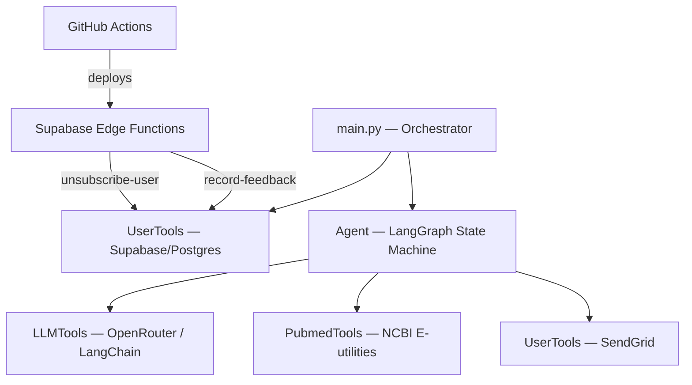

# PubMed Ambient Email Agent

An autonomous, event-driven AI agent that curates, summarizes, and delivers personalized medical research newsletters to patients using LangGraph, PostgreSQL, and OpenRouter.

This project demonstrates the ability to build reliable, stateful LLM pipelines that handle asynchronous data ingestion, deterministic structured outputs, and real-world API anomalies.

## System Architecture

Multi-node Directed Acyclic Graph (DAG) state machine using **LangGraph**.



1. Built a feedback-driven personalization recommendation system using PubMed's native similarity API (`elink`). Positive ratings trigger neighbor-scoring discovery, while negative ratings automatically extract MeSH keywords to build dynamic exclusion lists for future LLM queries.
2. Configurable back-off/retry loop if article quotas are unmet.
3. Replaced free-text generation with LangChain's structured output wrappers to guarantee deterministic structured `ESearchRequest` API parameters.

## Tech Stack

* Python 3.13, LangGraph, LangChain, OpenRouter (`BaseChatOpenAI`)
* PostgreSQL (Supabase) via SQLAlchemy + asyncpg with Supabase Edge Functions (Deno/TypeScript)
* NCBI PubMed E-utilities API, SendGrid

## Quick Start

### Prerequisites

* Python 3.13+
* `uv` package manager
* API Keys: OpenRouter, SendGrid, Supabase

### Setup

1. Clone the repository and install dependencies:

```bash
git clone https://github.com/ww-jx/pubmed-email-agent.git
uv sync

```

1. Configure environment variables:

```bash
cp .env.example .env

```

1. Run the orchestrator:

```bash
python main.py

```
